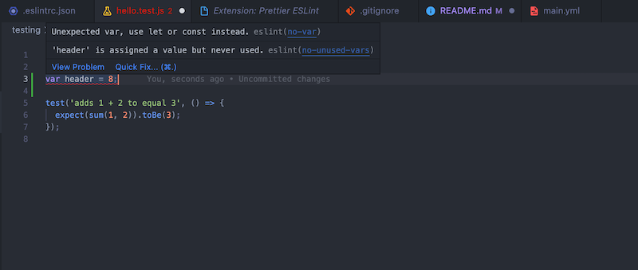

# Rocket Recipes

### Prepare for trouble, make it double! (servings)

This is Team Rocket's (Team 3) new & improved project repository for Rocket Recipes, a web application that allows users to search and create recipes for their own personal culinary escapades.

---

## Features

#### CRUD Basics & Improvements

Our project includes all CRUD features, including creating a new recipe, reading and viewing recipes, updating and editing recipes, and deleting recipes all together.

It is important to note that we changed our database to be Firebase from local storage. Through various tickets, we slowly connected Firebase to the user authentication, user favorite recipes, etc. to verify the user list.

It is important to note that in recipe creation, users can now create recipes via url; we did this using Spoonacular.

#### Search Overhaul

The original project contained a search feature, where users could search among the 1000+ recipes available in our database.

Now the search feature has been improved by:

1. The search algorithm is now more accurate and precise in the results it returns. It finds more results and delivers the most relevant results to the user. For example, “burger with aioli” wouldn’t return anything in old version, but now returns recipes that fit that description. A recipe survey shown at the creation of an account is also used to further improve search results according to user's preferences.
2. You can further filter your search with a list of ingredients, to only find recipes that have the same ingredients.
3. Search results are now shown in a series of pages, preventing infinite scrolling and not overwhelming the user.
4. Various bugs were fixed; i.e. searching with an empty input previously displayed all recipes in the database; now, the website prompts the user to enter an input.

#### Recipe Creation/Editing/Viewing

With this quarter, we improved the recipe experience in many ways:

1. Recipe inputs are now more strict to prevent "dirty code". Any text input goes through various checkpoints to be sanitize and corrected to a certain format. For example, users cannot have numbers in their recipe title.
2. Ingredients now have a checklist, so that users can check off items similar to a grocery list.

#### Various UI Improvements

1. We modernized the entire look of the website; in particular, the color scheme, logo, buttons, search bar, and recipe cards were changed to from a muted look to an updated version.

#### Voice Controls

This is an entirely new feature that we introduced. Users can navigate the search page with only their voice, and can navigate to recipe cards themselves.
Instructions to do:
Remember that while voice controls are active, it will try to interpret everything you say as a command, so don’t talk when the button is active lmao.

1. Go to the search page, and click on the voice button to start it.
2. Say: help, then close the command sheet.
3. Say: stop. Mention that the first time click the voice button, the help sheet opens. Then click the voice button to start it again.
4. Say: Search for “Apple Pie”
5. Say: Next Page (now you are on page 2 of results)
6. Say: Previous Page (you are back on page 1 of results)
7. Say: Open “Apple Cake”

## Repository Setup

The repository can be accessed at https://github.com/cse112-sp22-group3/rocketrecipes. We follow a development model similar to GitFlow. Deployments are hosted on the `deploy` branch, and the primary branch for development is `main`.

The repository is split up into various folders. The web application itself is inside `root/`, while our documentation is in `docs/` and automated tests are in `testing/`. Github Action workflows can be found at `.github/`. Dependencies can be found in the `package.json`. Other configuration files can also be found at `/`.

When contributing to the project, one should first create a new branch and submit a pull request when changes are complete. Then, there will be automated unit and end-to-end tests as well as a code quality tool to verify the quality of the pull request. Then, documentation will be automatically generated and a live deployment of the pull request will be created. After the pull request passes human review, it can be merged into `main` safely. After enough pull requests have been accumulated, a release will be made and the `deployment` branch will be updated.

---

## Testing

### Installation

**Step 1:** Install npm on your local machine

[Click here](https://docs.npmjs.com/downloading-and-installing-node-js-and-npm) to learn how to install Node.js and npm

**Step 2:** Install testing packages

We are using Jest and Jest Puppeteer to test our application, and you need to install both of them to get our tests working. First, install the testing packages by typing:
`npm install`

### Running Tests

We have two different types of tests, unit tests and end to end tests.

Our unit tests are done with plain Jest. To go through all unit tests, run the command

`npm run test-unit`

Our end to end tests are done with Jest Puppeteer. To go through each of these tests, run the command

`npm run test-e2e`

If you want to run all tests at the same time, you can use the command

`npm run test`

---

## Formatting

We are using ESLint and Prettier to format our files. For this reason, I've included their respective packages in our package.json.

We are using the [Airbnb](https://github.com/airbnb/javascript) style guide to format our code.

### Installation

The required packages will automatically be installed when you run `npm install` for the first time.

In order to get the linting to work inside your VSCode, please intall the following extentions:

[ESLint](https://marketplace.visualstudio.com/items?itemName=dbaeumer.vscode-eslint)

[Prettier ESLint](https://marketplace.visualstudio.com/items?itemName=rvest.vs-code-prettier-eslint)

Once you get these working, it should show you when you have style errors within your VSCode!

As you can see below, I'm using the var keyword which is a big no-go in modern JavaScript. VSCode makes the file header red and highlights the line. When I hover over that line, it tells me what I did wrong and I can easily change it!

### Usage

Before you commit your code, run the command

`npm run lint`

This will automatically format your code, and if it is not able to, show you what styling or formatting errors you have.

If you just want to see the formatting errors in your code and _not_ fix them, you can use the command

`npm run test-lint`

**You will not be able to merge your code into main until it passes all of the ESLint, Unit, and E2E tests.**
