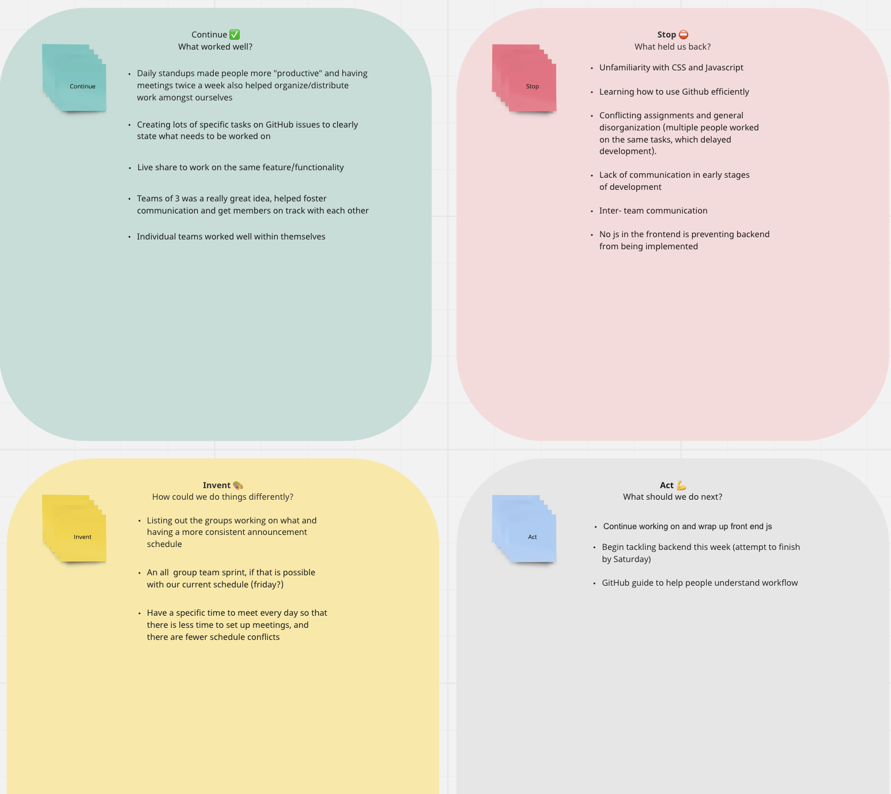

# Sprint 1 Retrospective
## Date: 11/22/2021

### What went well?
- Individual sub-teams worked well 
- Specific tasks on GH Issues helped clarify objectives
- More meetings meant more communication, which in turn generated more productivity
### What didn't go so well?
- Unfamiliarity with certain technologies
- Conflicting assignments and general disorganization
- Lack of commnunication in early stages of development
- No JavaScript in frontend prevented implemenetation of backend (harder to test functionality of product)
### How can we do things differently?
- Listing out objectives/tasks per group
  - Group members can communicate with each other to delegate tasks
- Consistent announcement schedule
- Team wide sprints might help facilitate a productive working environment
### What do we do next?
- Wrap up frontend JS 
- Tackle backend functionality (attempted deadline by Saturday)
- GitHub guide to help members understand developer workflow (pulling, editing, pushing, merging, etc.)

